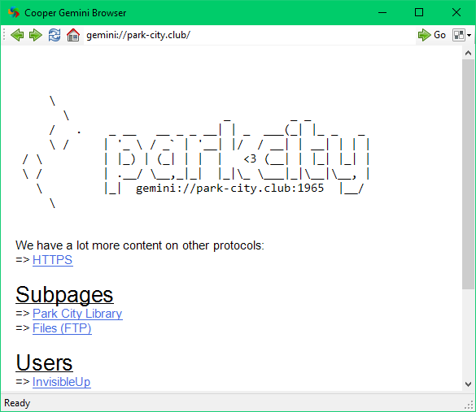

# Cooper

Cooper is a graphical browser for the [Gemini protocol](https://gemini.circumlunar.space), a new lightweight text-only internet protocol.

This is a fork of [Twin Peaks](https://github.com/InvisibleUp/twinpeaks) Gemini browser.

For the foreseeable future, Cooper only runs on Windows. It requires .NET Framework 4.8 or higher, which comes with all modern versions of Windows.

Download now at [the releases page](https://github.com/Open-Source-Gems/cooper/releases)

Do keep in mind that this project is still very young, so don't expect everything to work perfectly.
In particular, there isn't yet support for images, search pages, or client certificates.
